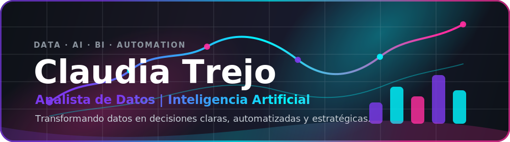
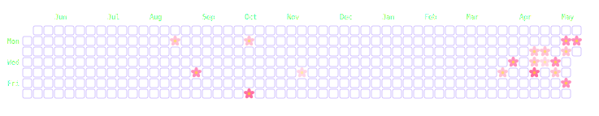

<picture>
  <source srcset="./assets/sakura-garden-dark.svg" media="(prefers-color-scheme: dark)" />
  <source srcset="./assets/sakura-garden.svg" media="(prefers-color-scheme: light)" />
  
</picture>

---

## ✨ Sobre mí

Soy Ingeniera en Informática con enfoque en **ciencia de datos, inteligencia artificial, automatización de procesos y business intelligence**.  
Me interesa transformar datos en información útil para la toma de decisiones, creando soluciones que automaticen procesos, optimicen reportes y permitan visualizar indicadores de forma clara y estratégica.

Actualmente trabajo con herramientas y tecnologías orientadas al análisis de datos, ETL, dashboards, automatización y desarrollo de soluciones web conectadas a bases de datos.

---

## 🚀 Áreas de interés

<table>
  <tr>
    <td bgcolor="#191724">📊 Análisis de datos y visualización de KPIs</td>
    <td bgcolor="#191724">🧠 Machine Learning e Inteligencia Artificial</td>
  </tr>
  <tr>
    <td bgcolor="#191724">⚙️ Automatización de procesos con Python</td>
    <td bgcolor="#191724">🗄️ SQL Server y modelamiento de datos</td>
  </tr>
  <tr>
    <td bgcolor="#191724">📈 Dashboards en Power BI y aplicaciones web</td>
    <td bgcolor="#191724">🔄 Procesos ETL y transformación de datos</td>
  </tr>
  <tr>
    <td colspan="2" align="center" bgcolor="#191724">🌐 Desarrollo backend y frontend para soluciones de datos</td>
  </tr>
</table>

---

## 🛠️ Tecnologías y herramientas

### Lenguajes y análisis de datos

### Business Intelligence y visualización

### Backend, frontend y automatización

### Bases de datos y control de versiones

---

## 📊 GitHub Stats

---

## ✨ Frase que me representa

> “Los datos no solo muestran lo que pasó, también ayudan a decidir mejor lo que viene.”
